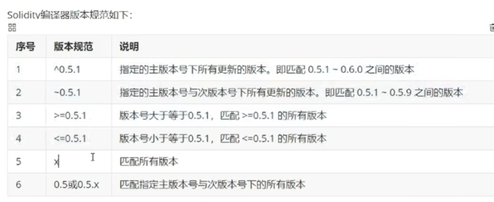

智能合约编程语言 --Solidity
solidity快速入门：https://solidity-rcc.vercel.app/
solidity描述：
    1.solidity是一种面向对象（合约） ,为实现智能合约而创建的高级编程语音
    2.solidity是一种针对以太坊虚拟机（EVM）设计的语言
    3.solidity是一种静态型语言，支持复杂的用户定义编程，支持库和集成

IDE开发工具：
    1.Remix Online IDE   
        https://remix.ethereum.org/#lang=en&optimize=false&runs=200&evmVersion=null&version=soljson-v0.8.26+commit.8a97fa7a.js
    2.Remix Desktop IDE
    3.Remix VSCode插件
    4.RemixD 命令行工具
 

Solidity中数据类型的定义
    solidity是一种静态语音，这意味着每个变量都需要在编译时指定变量的类型
    solidity中新声明的变量总是一个默认值，具体的默认值和类型有关，例如bool类型的默认值为false
    数据类型：值类型和引用类型
        值类型：
            布尔类型:true和false，默认false
            整型: int和uint ，分别表示有符合和无符号的整数，默认为0，支持int8- int256, uint8-uint256, 从8位到256位，以8位为步长递增， int和uint分别是int256和uint256的别名
            地址类型：address 包含一个20字节的值（代表一个以太坊地址的大小），一个地址可以用来获取余额，也可以通过转账的方式来转移余额,地址类型分为：address:普通地址类型（不可接收转账）和address payable:可收款地址类型（可接收转账）
                address addr = 0x690B9A9E9aa1C9dB991C7721a92d351Db4FaC990;
                address payable addr_pay = payable(0x8306300ffd616049FD7e4b0354a64Da835c1A81C);
            字节类型：bytes1,bytes2 ...bytes32字节用于存储固定大小的字符集，长度范围1-32，字节的一个优点是它使用更少的gas，所以当知道数据的长度时，最好使用它
            字符串类型：string，字符串用于存储等于或大于一个字节的字符集，字符串的长度是动态的
            枚举类型：enum，创建用户类型的数据类型，用于位一个整型常量分配一个名称，
        引用类型：
            引用类型变量存储数据的位置，在引用类型的定义中两个不同的变量可以引用同一个位置，其中
            一个变量的更改就会影响另一个变量，引用类型包括数组，结构，映射
    数组类型: 
        1） 数组是存储相同数据类型的固定元素集合的数据结构
        2）数组可以在声明时指定长度，也可以动态调整大小（长度）
        3）数组具有连续的内存位置，通过索引访问数组中的元素，索引从0开始
        4）数组元素可以是任何有效的solidity数据类型，包括映射或结构体
        定长数组：
            uint[] a [1,2,3]; 
            uint[3] b;
        动态数组:
            uint[] a;
        内存数组
            uint[] memory a = new uint;
        数组成员：length，push（x）,pop()
    结构体；
        通过创建结构体定义新的类型
        结构体是具有多个数据属性的数据类型
        结构体可以在一个合约之外声明并导入到另一个合约中
    映射：
        映射以键-值对（key-value）的形式存储数据
        键可以是任何内置数据类型，包括字节和字符串类型，但不允许引用类型，如数组，结构，映射
        值可以是任何数据类型，包括另一个映射或数组
        映射是不可迭代的，即无法通过遍历映射来枚举所有的键
        映射通常用于将唯一的以太坊地址和值类型关联起来
        mapping(address=> uint) public balances;
    常量：
        constant ：常量关键字，除了初始化外禁止赋值，常量不占用存储槽位，没有gas费用
        immutable：不可变量的关键字，只允许在构造时赋值一次，之后同常量一样，没有gas费用
        uint public constant My_Uint1 = 123;
        uint public immutable My_Uint2;
    变量：
        变量名不应与保留关键字匹配
        变量名称必须以字母或下划线_开头，可以包含a-z,A-Z,0-9或其他字符
        变量名称区分大小写

        变量声明语法：<data type><access modifier><variable name> = <initialization>;
            data type:数据类型，可以是任何数据类型，包括值类型和引用类型
            access modifier:访问修饰符public,private,interval三种
            variable name:符号命名规则的变量名
            initalization:变量的初始值，非必填
            例如：uint public i = 1;
            变量类型：
                状态变量
                局部变量
                全局变量
        引用类型：
            数组、结构体、映射，
            在solidity中使用引用类型的时候，必须指定数据的位置。
        变量的存储位置与作用域
            1.storage  
                链上存储空间，该存储位置用于存储永久数据，只要合约存在阿数据就一直有效，存储的gas较高
                其中：状态变量的存储方式强制使用storage
                    局部变量的存储方式可以声明成storage,memory,或calldata
                    映射（mapping）智能存储在storage中
            2.memory 
                内存存储，数据只在声明周期内有效，暂时性存储，函数的入参
            3.calldata 
                调用数据，一个特殊的只读数据位置，用来存储函数调用的参数
                暂时性存储，函数的入参，变量不可修改
            4.stack
            5.codes
            6.logs
            总结：
                1.状态变量的存储方式：storage
                2.局部变量的存储方式可以声明storage,memory,calldata
                3.公用函数public和外部函数external中，函数的存储方式只能是memory,calldata
                4.私有函数private和内部函数internal中，函数的存储方式还可以是storage
                5.映射mapping只能存储在storage中，且不能再函数内部定义，映射一般声明为状态变量
                6.一般建议将函数参数和局部变量的存储方式声明为memory
操作符：
    1.算术运算符
        +
        -
        *
        /
        %
        ++
        --
        ** ：求幂
    2.关系运算符
        ==
        !=
        >
        <
        >=
        <=
    3.逻辑运算符
        &&
        ||
        !
    4.按位运算符
        &
        |
        ^
        -
        <<
        >>
    5.赋值运算符
        =
        +=
        -=
        *=
        /=
        %=
        &=
        |=
        ^=
        <<=
        >>=
    6.条件运算符
        if condition true？ then A: else B
    7.delete运算符
        delete a
控制结构
    条件控制：if else
    循环控制: for / while / do - while  (不建议使用while)
函数
    函数可以在合约内部和外部定义
    在合约外部定义的函数为自由函数，并始终有隐式的可见性
    function <function name>(<paramslist>) <access specifier> <pure | view> {
        return (resultlist) {
            block of code;
        }
    }

solidity合约
    在solidity中，合约类似于其他语音中的类，它有自己的成员属性和成员函数
    