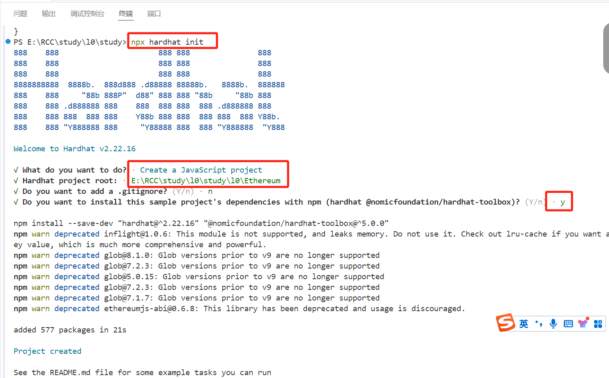
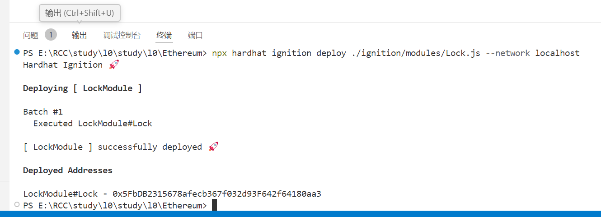

1、工具
    IDE:
        visual studio code：
        remix: 一种基于浏览器的编译器和 IDE，可以通过它来使用 Solidity 生成 Ethereum 合约，并使用它调试交易。 Remix 是探索合约示例的好途径。 你可以使用它来编写、测试和部署自己的合约。 在此模块中，我们不会使用 Remix，但你可以在合约练习中自行体验它
    扩展：
        solidity vs code: 此扩展可以简化在 Ethereum 账本上创建、生成和部署智能合约的方式。 此扩展具有与 Truffle、Ganache 等工具和服务的内置集成。 在此模块中，我们将使用此扩展编写和测试智能合约。
    框架：
        hardhat:在将 Ethereum 合约部署到公共账本并产生实际成本之前，使用 Hardhat 工具套件对其进行测试。开发人员可在本地进行开发，以便于其工作
        openzeppelin:使用 OpenZeppelin 工具编写、部署和操作去中心化应用程序。 OpenZeppelin 提供了两个产品：合约库和 SDK。 在此模块中
        
1. npm install --save-dev hardhat
2. npx hardhat init
   
3. select: Create a JavaScript project, 其他默认选择，直至project created
4. 项目创建后，显示目录文件
    合约：contracts文件夹中包含 Lock.sol 合约
    ignition：包含对我们的示例合约的部署代码 ignition/modules/Lock.js
    测试：包含以对Lock合约的测试文件 test/Lock.js 你还会看到下面的配置文件：
    package.json：定义项目详细信息和依赖项
    hardhat.config.js：关于hardhat的配置 
5.编译合约：npx hardhat compile  ,编译成功后会生成artifacts文件夹
6.部署合约： 
    启动本地网络 npx hardhat node
    部署合约 npx hardhat ignition deploy ./ignition/modules/Lock.js --network localhost 
    

7.启动本地网络时，如端口已经被占用
    在cmd中输入 netstat -ano | findstr :8545 ，找到PID，再taskkill /PID 94088 /F

8.运行测试
    npx hardhat test test/Shipping.js